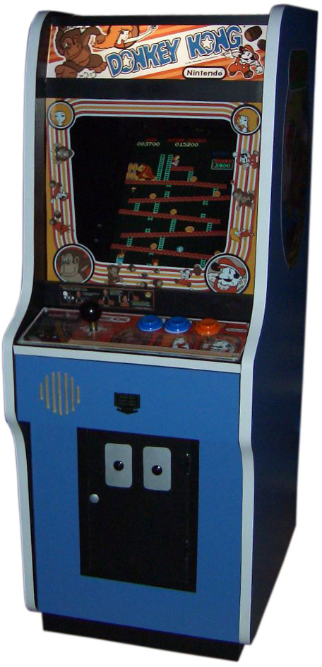
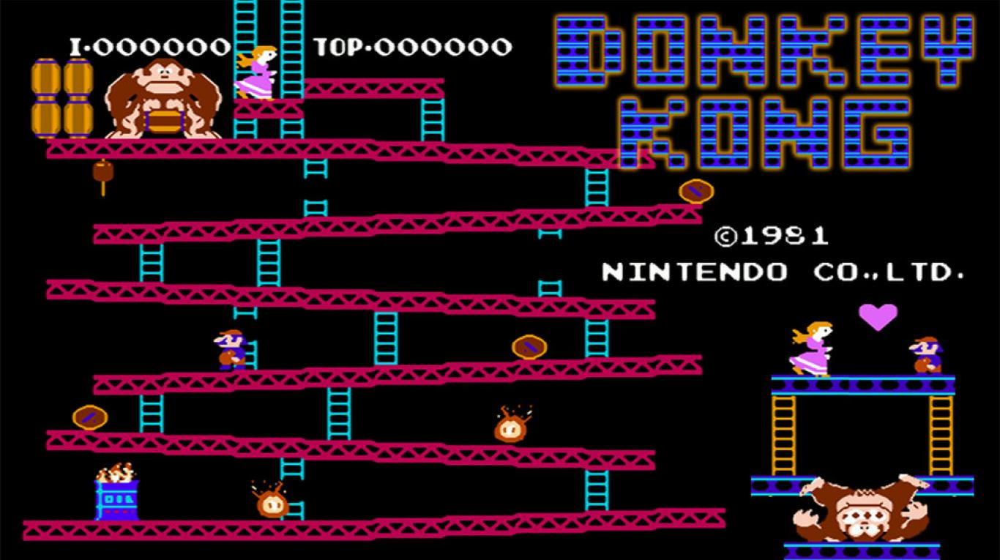
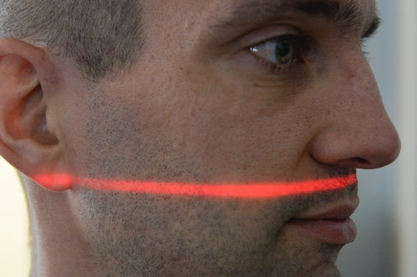
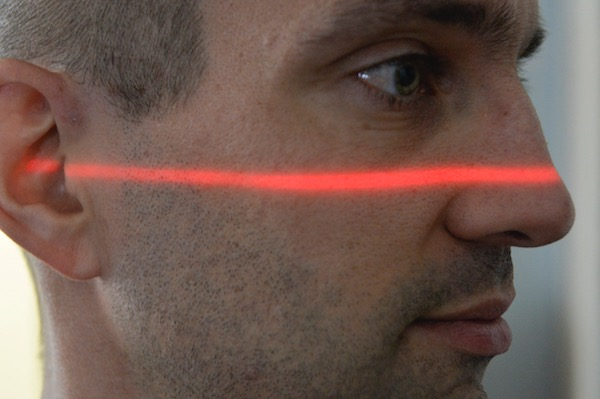
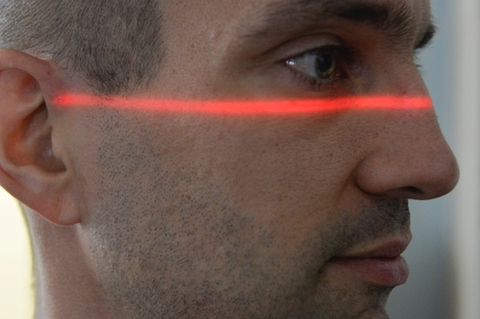
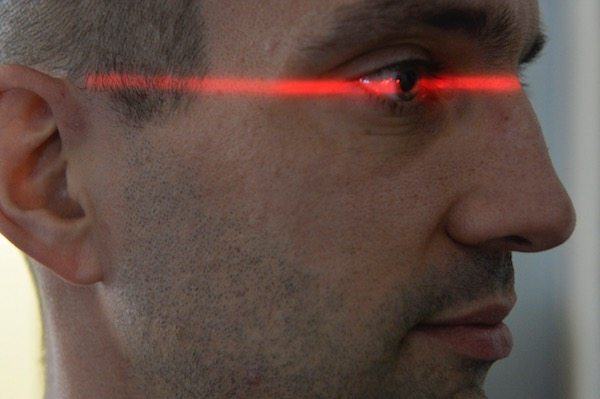
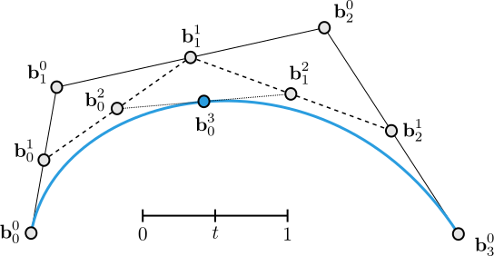
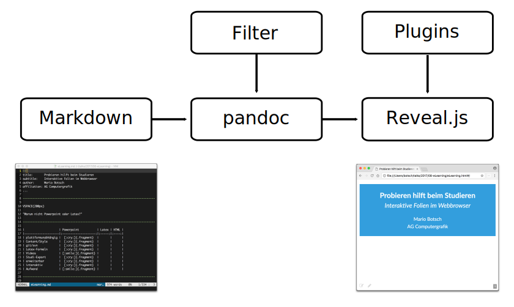

---
title:        Probieren hilft beim Studieren
subtitle:     Interaktive Vorlesungsfolien im Webbrowser
author:       Prof. Dr. Mario Botsch
affiliation:  Lehrstuhl für Computergraphik, TU Dortmund
bibliography: bibliography.bib
width:        1280
height:       800
link-citations: true
...


# Anleitung für die HTML-Folien

- Mit **Cursor-links**/**Cursor-rechts** Folien durchschalten
- Klick auf Icon <i class="fas fa-bars"></i> (links oben) öffnet das Navigationsmenü
- Mit **f**/**ESC** Fullscreen-Modus an-/abschalten
- **Doppelklick** auf ein Element (z.B. ein Bild) für Rein-/Raus-Zoomen
- Mit **Ctrl-Shift-f** den Such-Dialog öffnen, mit **ESC** schließen.
- Zum virtuellen Whiteboard **runter-scrollen**, wenn der untere Rand blinkt
- Für die 3D-Demos am besten Google Chrome oder Firefox verwenden. 
  Apple's Safari implementiert leider nicht alle nötigen Web-Standards, so dass
  manche interaktiven Demos nicht funktionieren.
    - Klick auf Icon <i class="fas fa-expand-arrows-alt"></i> (recht oben im Demo-Fenster) 
      bringt Demos in den Fullscreen-Modus.


--------------------------------------------------------------------------------

# Features der HTML-Folien {.section}

--------------------------------------------------------------------------------


# Bilder und Videos

::: col50
{ height=400px }
:::

::: col50
{ height=400px .controls .autoplay }
:::


# Aufzählungen

::: col50
::: incremental
- Supermario
    - Der Held
- Peach
    - Die Prinzessin
- Donkey Kong
    - Der Böse
:::
:::

::: col50
{ height=180px }
{      height=220px }
{ height=300px }
:::


# Textauszeichnungen

::: col50
- **Supermario**
    - ist fett
- Prinzessin ^Peach^
    - ist hochgestellt
- *Donkey Kong*
    - ist schräg
:::

::: col50
{ height=180px }
{      height=220px }
{ height=300px }
:::


# Numerierungen

::: col50
1. Donkey Kong
    - entführt Peach
2. Mario
    - rettet Peach
3. Peach
    - findet Mario toll
:::

::: col50

:::


# Task-Listen

::: {.col50 .left .check-cross}
- Was können wir?
    - [X] Mathe
    - [X] Informatik
    - [ ] alles andere
:::

::: {.col50 .left .plus-minus}
- Stärken/Schwächen?
    - [X] Mathe
    - [X] Informatik
    - [ ] alles andere
:::

::: {.col50 .left .thumb}
- Was ist cool?
    - [X] Mathe
    - [X] Informatik
    - [ ] alles andere
:::

::: {.col50 .left}
- Wer braucht mehr :moneybag:?
    - [X] Mathe
    - [X] Informatik
    - [X] alle anderen
:::


# Mathe-Formeln mit [MathJax](https://www.mathjax.org/)

- Navier-Stokes-Gleichungen
  $$\begin{eqnarray}
    \dot{\vec{u}} &=& 
    \fragment{-\vec{u}\cdot\grad\vec{u}}
    \fragment{\;-\; \frac{1}{\rho}\grad p}
    \fragment{\;+\; \nu \laplace \vec{u}}
    \fragment{\;+\; \vec{f}} 
    \label{eq:momentum} \\[2mm]
    \grad \cdot \vec{u} &=& 0 
    \label{eq:incompressibility}
  \end{eqnarray}$$
- Formeln können schrittweise eingeblendet werden
- Formeln können referenziert und verlinkt werden


# Zeilenweises Einblenden von Gleichungen

::: math-incremental
$$
\begin{align*}
\dot{\mat{R}}(t) \, \bar{\vec{r}}_i 
&=
\diff{\mat{R}}{\alpha} \,
\diff{\alpha}{t} \,
\bar{\vec{r}}_i \\
&=
\matrix{
	-\sin\alpha & -\cos\alpha \\ 
	\cos\alpha & -\sin\alpha }
\dot{\alpha} \, \bar{\vec{r}}_i \\[2mm]
&=
\matrix{
	\cos(\alpha+90^\circ) & -\sin(\alpha+90^\circ) \\ 
	\sin(\alpha+90^\circ) & \cos(\alpha+90^\circ) }
\, \bar{\vec{r}}_i \, \dot{\alpha} \\[2mm]
&=
\matrix{
	\cos(90^\circ) & -\sin(90^\circ) \\ 
	\sin(90^\circ) & \cos(90^\circ) }
\,
\matrix{
	\cos(\alpha) & -\sin(\alpha) \\ 
	\sin(\alpha) & \cos(\alpha) }
\, \bar{\vec{r}}_i \, \dot{\alpha} \\[2mm]
&=
\omega \, \vec{r}_i^\perp
\end{align*}
$$
:::

::: footer
Hier der Link auf vorherige Formel: $\eqref{eq:momentum}$.
:::


# Virtuelle Tafel

::: incremental

- Herleitungen an der Tafel sind nicht in Videoaufzeichnung
- Herleitungen auf den Folien sind zu schnell
  [$$
  \begin{eqnarray*}
  a &=& b \\
  a^2 &=& ab \\
  2a^2 &=& a^2 + ab \\
  2a^2-2ab &=& a^2 - ab \\
  2a(a-b) &=& a (a-b) \\
  2a &=& a \\
  2 &=& 1
  \end{eqnarray*}
  $$]{ .math-incremental }
- Die virtuelle Tafel ist ein guter Kompromiss :thumbsup:

:::


# Source Code mit [highlight.js](https://highlightjs.org/)

::: col50
``` {.haskell .line-numbers caption="Quicksort in Haskell<br>(mit Code-Hervorhebungen)"}
qsort []     = []
qsort (x:xs) = <mark>qsort small ++ mid ++ qsort large</mark>
  where
    small = [y | y<-xs, y<x]
    mid   = [y | y<-xs, y==x] ++ [x]
    large = [y | y<-xs, y>x]
```
:::

::: col50
``` {.cpp line-numbers="5-10" caption="\\(\pi\\) ausrechnen in C++<br>(mit Zeilen-Hervorhebungen)"}
int     i, N=100000000;
double  x, dx=1.0/(double)N;
double  f, pi=0.0;

for (i=0; i<N; ++i)
{
	x = (i+0.5) * dx;
	f = 4.0 / (1.0 + x*x);
	pi += dx * f;
}

printf("pi = %f\n", pi);
```
:::


# Webseiten

{ width=800px height=600px .print }


# Tabellen

|                     | Powerpoint | LaTeX-Beamer | HTML-Folien |
|---------------------|:----------:|:------------:|:-----------:|
| plattformunabhängig |     😢     |      😊      |      😊     |
| Mathe-Formelsatz    |     😢     |      😊      |      😊     |
| Videos              |     😊     |      😢      |      😊     |
| Studi-Export        |     😢     |      😢      |      😍     |
| erweiterbar         |     😢     |      😢      |      😍     |
| interaktiv          |     😢     |      😢      |      😍     |
| Aufwand             |     😊     |      😢      |      😭     |

Table: Warum sind HTML-Folien so toll?


# Bibliographie mit BibTeX

- Bibliographie kann mit BibTeX verwaltet werden. 
- Die Referenzliste wird dann automatisch erstellt (siehe nächste Folie).
- Hier ein Beispiel:
    - Realistische Avatare sind toll [@waltemate2018] :thumbsup:.
    - @achenbach2017 können sie in <10 Minuten erzeugen :astonished:.
    - Sie können in Echtzeit animiert werden [@komaritzan2019] :muscle:.


# Referenzen

::: { #refs }
:::


# PDF-Unterstützung

::: col50
- Folien lassen sich auf Knopfdruck als PDF-Dokument exportieren.
- PDF-Dokumente lassen sich in Präsentationen einbinden
:::
::: col50
{ width=600px height=500px }
:::


--------------------------------------------------------------------------------

# Statische und dynamische Visualisierungen {.section}

--------------------------------------------------------------------------------


# Bild-Sequenzen

{ height=500px .fragment .sequence }
{ height=500px .fragment .sequence }
{ height=500px .fragment .sequence }
{ height=500px .fragment .sequence }


# Animierte Vektorgrafiken

{ .embed }


# Interaktive Charts mit [chart.js](https://www.chartjs.org/)

``` bar-chart
1.0, 1.3, 1.7, 2.0, 2.3, 2.7, 3.0, 3.3, 3.7, 4.0, 5.0
Irgendwelche Zahlen, 5, 6, 5, 2, 3, 3, 4, 3, 3, 5, 11
Andere Zahlen, 11, 8, 5, 5, 2, 7, 4, 1, 5, 0, 15
```


# Interaktive Charts mit [chart.js](https://www.chartjs.org/)

``` pie-chart
1.0, 1.3, 1.7, 2.0, 2.3, 2.7, 3.0, 3.3, 3.7, 4.0, 5.0
Irgendwelche Zahlen, 5, 6, 5, 2, 3, 3, 4, 3, 3, 5, 11
```


# Interaktive Charts mit [chart.js](https://www.chartjs.org/)

``` { .line-chart title="Poisson-System lösen" }
100k, 200k, 300k, 400k, 500k
Conjugate Gradients, 3.19, 11.6, 23.6, 37.3, 47.4
Sparse Cholesky, 0.21, 0.52, 0.83, 1.21, 1.54
<!--
{
  "data": {
    "datasets":[
    { "backgroundColor": "rgba(255,255,255,0)" },    
    { "backgroundColor": "rgba(255,255,255,0)" } 
    ]
  }
}
-->
```


# Graph-Diagramme mit [GraphViz](https://www.graphviz.org/)

``` {.dot .render height=500px }
digraph {
    node [style = filled]
    A [fillcolor = red]
    C [fillcolor = green]
    D [fillcolor = blue]
    A -> B 
    A -> C
    C -> D
    C -> E
    C -> F
    B -> D
}
```


# Diagramme mit Tikz/Latex

``` {.tex .render width=500px}
\documentclass{standalone}
\usepackage{tikz}
\usepackage{verbatim}
\begin{document}
\pagestyle{empty}
\begin{tikzpicture}[scale=3,cap=round]
  % Local definitions
  \def\costhirty{0.8660256}

  % Colors
  \colorlet{anglecolor}{green!50!black}
  \colorlet{sincolor}{red}
  \colorlet{tancolor}{orange!80!black}
  \colorlet{coscolor}{blue}

  % Styles 
  \tikzstyle{axes}=[]
  \tikzstyle{important line}=[very thick]
  \tikzstyle{information text}=[rounded corners,fill=red!10,inner sep=1ex]

  % The graphic
  \draw[style=help lines,step=0.5cm] (-1.4,-1.4) grid (1.4,1.4);

  \draw (0,0) circle (1cm);

  \begin{scope}[style=axes]
    \draw[->] (-1.5,0) -- (1.5,0) node[right] {$x$};
    \draw[->] (0,-1.5) -- (0,1.5) node[above] {$y$};

    \foreach \x/\xtext in {-1, -.5/-\frac{1}{2}, 1}
      \draw[xshift=\x cm] (0pt,1pt) -- (0pt,-1pt) node[below,fill=white]
            {$\xtext$};

    \foreach \y/\ytext in {-1, -.5/-\frac{1}{2}, .5/\frac{1}{2}, 1}
      \draw[yshift=\y cm] (1pt,0pt) -- (-1pt,0pt) node[left,fill=white]
            {$\ytext$};
  \end{scope}

  \filldraw[fill=green!20,draw=anglecolor] (0,0) -- (3mm,0pt) arc(0:30:3mm);
  \draw (15:2mm) node[anglecolor] {$\alpha$};

  \draw[style=important line,sincolor]
    (30:1cm) -- node[left=1pt,fill=white] {$\sin \alpha$} +(0,-.5);

  \draw[style=important line,coscolor]
    (0,0) -- node[below=2pt,fill=white] {$\cos \alpha$} (\costhirty,0);

  \draw[style=important line,tancolor] (1,0) --
    node [right=1pt,fill=white]
    {
      $\displaystyle \tan \alpha \color{black}=
      \frac{ {\color{sincolor}\sin \alpha} }{\color{coscolor}\cos \alpha}$
    } (intersection of 0,0--30:1cm and 1,0--1,1) coordinate (t);

  \draw (0,0) -- (t);
\end{tikzpicture}
\end{document}
```


# Plots mit [gnuplot](http://www.gnuplot.info/)

``` {.gnuplot .render height=500px }
set xrange [0:2500]
set yrange [0:1500]
set fit quiet
set xtics nomirror
set ytics nomirror 
set key off
set tic font ",20"
set border 3
set margins 15

set xlabel "Grundstückspreis in 1000€" textcolor rgb "black" font "Arial, 25" offset 0
set ylabel "Grundstücksgröße in m^2" textcolor rgb "black" font "Arial, 25" offset 0 rotate by 90

f1(x) = a + b * x
f2(x) = c + d * x + e * x * x
f3(x) = f + g * x + h * x * x + i * x * x * x

FIT_LIMIT = 1e-6

fit [0:2000] [0:1500] f1(x) "data/house-price-to-size.dat" via a,b
fit [0:2000] [0:1500] f2(x) "data/house-price-to-size.dat" via c,d,e
fit [0:2000] [0:1500] f3(x) "data/house-price-to-size.dat" via f,g,h,i

plot "data/house-price-to-size.dat" with points pt 7 ps 1 lw 1 lc rgb "#F09838", f1(x) title "Test" lc "blue"  lw 3, f2(x) lc "green" lw 3,  f3(x) lc "red" lw 3
```
[Marc Latoschik, Uni Würzburg]{.footer}


# Interaktive Plots

{ width=1000px height=600px .print }

[Martin Heistermann, Uni Bern]{.footer}


# 3D-Modelle

{ width=800px height=550px }

[[Polygon Mesh Processing Library](http://pmp-library.org)]{.footer}


--------------------------------------------------------------------------------

# Interaktive Demos {.section}

--------------------------------------------------------------------------------


# Interaktive Demos in Javascript

{ width=1000px height=600px .print }


# Interaktive Demos mit [D3.js](https://d3js.org/)

{ width=1000px height=600px .print }


# Komplexere Demos in C++

{ width=1000px height=600px }


# Interaktive Mathe mit SAGE

::: { .sageCell .stretch .print }

Wir definieren ein paar Punkte $\mathbf{x}_1, \dots, \mathbf{x}_6$ und verbinden sie zu einem Linienzug:

``` sage
points = matrix([ [0,0], [1,1], [2,-1], [3,0], [2.5,0.5], [3,1] ])
pointsPlot = plot(line(points, color="red", aspect_ratio=1))
show(pointsPlot)
```

Jetzt interpolieren wir die Punkte $\mathbf{x}_1, \dots, \mathbf{x}_n$ mit einem Polynom vom Grad $n-1$.
Testen Sie verschiedene Werte für $n \in \{2, \dots, 6 \}$. Was fällt auf?

``` sage
# select n points
n = 6
B = points.submatrix(0,0,n,2)

# define matrix for polynomial interpolation
A = matrix(n, n, lambda i,j: i^j)

# solve A*X=B, then X contains the poly coefficients
X = A\B

# define function for evaluating polynomial
var('k, coeffs, t')
def curve(coeffs, t):
    return sum(coeffs[k] * t^k for k in [0..n-1])
   
# finally, plot fitted curves and point set
curvePlot = parametric_plot(curve(X,t), (t, 0, n-1))
show(pointsPlot + curvePlot)
```
:::


# Interaktives Python

::: { .sageCell .stretch .print }
``` python
from math import exp,pi,cos,sin
import matplotlib.pyplot as plt
import numpy as np
x0=1; t0=0; tf=25; x=x0; t=t0;
h = pi/16
X=[]
T=[]
while t < tf:
    X.append(x)
    T.append(t)
    x = x + h*(-x*cos(t));
    t = t+h
plt.plot(T,X,'b*--')
T1=np.linspace(t0,tf,200);
plt.plot(T1,[exp(-sin(t)) for t in T1],'r-')
plt.title('h = %f' % (h))
plt.legend(('Numerical solution','Exact solution'),loc='upper left')
plt.show()
```
:::

[Example from Roberto De Leo, Howard University]{.footer}


# Interaktive Statistik mit R und SAGE

::: { .sageCell .stretch .print }
Die Trainingsdaten bestehen aus Alter und Maximalpuls als $x$- und $y$-Koordinaten.

``` rr
x = c(18,23,25,35,65,54,34,56,72,19,23,42,18,39,37) # ages of individuals
y = c(202,186,187,180,156,169,174,172,153,199,193,174,198,183,178) # maximum heart rate of each one
plot(x,y) # make a plot
```

Wir fitten jetzt eine Gerade durch lineare Regression:

``` rr
plot(x,y) # make a plot
lm(y ~ x) # do the linear regression
abline(lm(y ~ x)) # plot the regression line
```
:::


# Shader-Programmierung

{ .stretch }


# Quizzes und Selbstlernphase {.section}


<!-- # Audience Response System

<div id="quiz-qr" style="width:500px; margin:auto"></div>
<p id="quiz-url"></p> -->


# Audience Response System 

{height=100px}
Wer bekommt am Ende die Prinzessin?

::: {.quiz .w80}
- [ ] Donkey Kong {height=100px}
    - Nein, der ist böse!
- [ ] Sponge Bob {height=100px}
    - Nein, der lebt unter Wasser!
- [ ] Kleine A-Loch {height=100px}
    - Nein, den mag keiner!
- [X] Supermario {height=100px} 
    - Klar!
:::

[Hier können Vorlesungsteilnehmer*innen online abstimmen, wenn der Quiz-Server gestartet wird.]{.footer}


# Zuordnungsaufgaben

"Who is who" per Drag&Drop zuordnen

[:vspace](30px)

::: quiz-mi
Prinzessin
: {height=100px}

Donkey Kong
: {height=100px}

Supermario
: {height=100px}
:::


# Zuordnungsaufgaben

[:vspace](30px)

::: quiz-mi
Laplacian
: $\laplace f$

Gradient
: $\grad f$

Divergence
: $\grad \cdot f$ 

Quatsch
: $\laplace \cdot f$ 
:::


# Freitextaufgaben

[:vspace](30px)

::: col40
{height=150px}
:::
::: {.col60 .quiz-ft}
Wie heißt die Prinzessin?

- [x] Peach
- [ ] Lilifee
:::

[:vspace](50px)

::: col40
{height=150px}
{height=150px}
{height=130px}
:::
::: {.col60 .quiz-ic}
Die Prinzessin ist verliebt in 

- [ ] Donkey Kong
- [x] Supermario
- [ ] Sponge Bob
:::


# Fragensammlung

- Mit dem Icon <i class="fas fa-question-circle"></i> (oben rechts) können Studierende pro Folie anonym Fragen posten.
- Die Fragen sind für alle Vorlesungsteilnehmer*innen sichtbar und können dann z.B. in einer Online-Fragestunde besprochen werden.
- Im Menu (Icon <i class="fas fa-bars"></i> oben links) werden die Fragen in der Folienübersicht auch angezeigt.


--------------------------------------------------------------------------------

# Folienerstellung {.section}

--------------------------------------------------------------------------------


# Von Markdown zu HTML

{ .embed }


# Open-Source "Zutatenliste"

::: w80

- [Reveal.js](https://github.com/hakimel/reveal.js/)
    - Javascript-Framework zur Darstellung von Folien im Webbrowser
- [Pandoc](https://pandoc.org/)
    - Tool/Bibliothek zur Konvertierung von Markdown in Reveal.js-Folien.
- [decker](https://gitlab2.informatik.uni-wuerzburg.de/decker/decker)
    - `decker` basiert auf `pandoc` und übersetzt Markdown in HTML-Folien.
    - Es erweitert `pandoc` und `reveal.js` um zusätzliche Filter und Plugins.
    - Wird entwickelt von 
      [Prof. Henrik Tramberend](https://tramberend.beuth-hochschule.de/) (Beuth Hochschule Berlin),
      [Prof. Mario Botsch](https://graphics.uni-bielefeld.de/people/botsch_mario/botsch_mario.html) (TU Dortmund) und
      [Prof. Marc Latoschik & Team](http://hci.uni-wuerzburg.de/people/marc/) (Uni Würzburg).
    - Wird verwendet an Uni Würzburg, Beuth Hochschule Berlin, TU Dortmund, Uni Osnabrück, Uni Magdeburg, Uni Bern und EPFL.
:::
