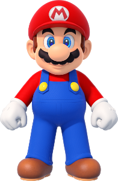
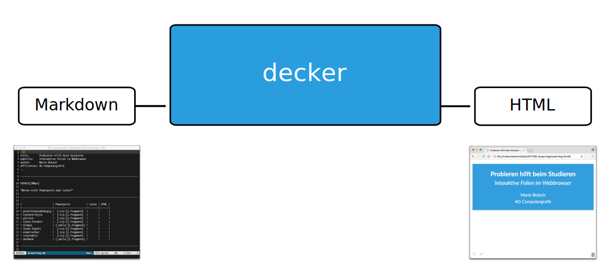

---
title:       Probieren hilft beim Studieren
subtitle:    Interaktive Vorlesungsfolien im Webbrowser
author:      Mario Botsch
affiliation: Universität Bielefeld
width:       1280
height:      800
...


# Anleitung für die HTML-Folien

- Mit **Cursor-links**/**Cursor-rechts** Folien durchschalten
- Klick auf **Seitenzahl** (rechts unten) öffnet Navigationsmenü
- Mit **f**/**ESC** Fullscreen-Modus an-/abschalten
- **Doppelklick** auf ein Element (z.B. ein Bild) für Rein-/Raus-Zoomen
- Wenn das **Icon** unten rechts rot ist 
  (<i class="fas fa-edit small" style="color:red"></i>),
  wurde etwas auf die virtuelle Tafel geschrieben. 
  Ein Mausklick auf das Icon zeigt/versteckt die Tafel.
- Für die 3D-Demos am besten Google Chrome oder Firefox verwenden.


--------------------------------------------------------------------------------

# Features der HTML-Folien {.section}

--------------------------------------------------------------------------------


# Aufzählungen

::: col50
::: incremental
- Supermario
    - Der Held
- Peach
    - Die Prinzessin
- Donkey Kong
    - Der böse Affe
:::
:::

::: col50
{ height=180px }
{      height=220px }
{ height=300px }
:::


# Textauszeichnungen

::: col50
- **Supermario**
    - ist fett
- Prinzessin ^Peach^
    - ist hochgestellt
- *Donkey Kong*
    - ist schräg
:::

::: col50
{ height=180px }
{      height=220px }
{ height=300px }
:::


# Numerierungen

::: col50
1. Donkey Kong
    - entführt Peach
2. Mario
    - rettet Peach
3. Peach
    - findet Mario toll
:::

::: col50

:::


# Task-Listen

::: {.col50 .left}
- Was ist abgehakt?
    - [X] Mathe
    - [X] Informatik
    - [ ] alles andere
:::

::: {.col50 .left .thumb}
- Was ist cool?
    - [X] Mathe
    - [X] Informatik
    - [ ] alles andere
:::

::: {.col50 .left .check-cross}
- Was können wir?
    - [X] Mathe
    - [X] Informatik
    - [ ] alles andere
:::

::: {.col50 .left .plus-minus}
- Stärken/Schwächen?
    - [X] Mathe
    - [X] Informatik
    - [ ] alles andere
:::


# Bilder und Videos

::: col50
{ height=400px }
:::

::: col50
{ height=400px .controls .autoplay }
:::


# Bild-Sequenzen

{ width=500px .fragment .sequence }
{ width=500px .fragment .sequence }
{ width=500px .fragment .sequence }
{ width=500px .fragment .sequence }


# 3D-Modelle

{ width=800px height=600px }


# Animierte Vektorgrafiken

{#svg width=800px}


# Webseiten

{ #demo width=800px height=600px }


# Source Code mit [highlight.js](https://highlightjs.org/)

::: col50
Quicksort in Haskell\
``` haskell
qsort []     = []
qsort (x:xs) = qsort small ++ mid ++ qsort large
  where
    small = [y | y<-xs, y<x]
    mid   = [y | y<-xs, y==x] ++ [x]
    large = [y | y<-xs, y>x]
```
:::

::: col50
$\pi$ ausrechnen in C++\
``` cpp
int     i, N=100000000;
double  x, dx=1.0/(double)N;
double  f, pi=0.0;

for (i=0; i<N; ++i)
{
	x = (i+0.5) * dx;
	f = 4.0 / (1.0 + x*x);
	pi += dx * f;
}

printf("pi = %f\n", pi);
```
:::


# Tabellen

|                     | Powerpoint | LaTeX-Beamer | HTML-Folien |
|---------------------|:----------:|:------------:|:-----------:|
| plattformunabhängig |     😢     |      😊      |      😊     |
| Versionsverwaltung  |     😢     |      😊      |      😊     |
| Mathe-Formelsatz    |     😢     |      😊      |      😊     |
| Videos              |     😊     |      😢      |      😊     |
| Studi-Export        |     😢     |      😢      |      😍     |
| erweiterbar         |     😢     |      😢      |      😍     |
| interaktiv          |     😢     |      😢      |      😍     |
| Aufwand             |     😊     |      😢      |      😭     |


# Interaktive Charts mit [chart.js](https://www.chartjs.org/)

``` bar-chart
1.0, 1.3, 1.7, 2.0, 2.3, 2.7, 3.0, 3.3, 3.7, 4.0, 5.0
Irgendwelche Zahlen, 5, 6, 5, 2, 3, 3, 4, 3, 3, 5, 11
Andere Zahlen, 11, 8, 5, 5, 2, 7, 4, 1, 5, 0, 15
```


# Interaktive Charts mit [chart.js](https://www.chartjs.org/)

``` pie-chart
1.0, 1.3, 1.7, 2.0, 2.3, 2.7, 3.0, 3.3, 3.7, 4.0, 5.0
Irgendwelche Zahlen, 5, 6, 5, 2, 3, 3, 4, 3, 3, 5, 11
```


# Graph-Diagramme mit [GraphViz](https://www.graphviz.org/)

``` {.dot .render height=500px}
digraph {
    node [style = filled]
    A [fillcolor = red]
    C [fillcolor = green]
    D [fillcolor = blue]
    A -> B 
    A -> C
    C -> D
    C -> E
    C -> F
    B -> D
}
```


# Diagramme mit Tikz/Latex

``` {.tikz .render height=500px}
\begin{tikzpicture}[scale=3,cap=round]
  % Local definitions
  \def\costhirty{0.8660256}

  % Colors
  \colorlet{anglecolor}{green!50!black}
  \colorlet{sincolor}{red}
  \colorlet{tancolor}{orange!80!black}
  \colorlet{coscolor}{blue}

  % Styles 
  \tikzstyle{axes}=[]
  \tikzstyle{important line}=[very thick]
  \tikzstyle{information text}=[rounded corners,fill=red!10,inner sep=1ex]

  % The graphic
  \draw[style=help lines,step=0.5cm] (-1.4,-1.4) grid (1.4,1.4);

  \draw (0,0) circle (1cm);

  \begin{scope}[style=axes]
    \draw[->] (-1.5,0) -- (1.5,0) node[right] {$x$};
    \draw[->] (0,-1.5) -- (0,1.5) node[above] {$y$};

    \foreach \x/\xtext in {-1, -.5/-\frac{1}{2}, 1}
      \draw[xshift=\x cm] (0pt,1pt) -- (0pt,-1pt) node[below,fill=white]
            {$\xtext$};

    \foreach \y/\ytext in {-1, -.5/-\frac{1}{2}, .5/\frac{1}{2}, 1}
      \draw[yshift=\y cm] (1pt,0pt) -- (-1pt,0pt) node[left,fill=white]
            {$\ytext$};
  \end{scope}

  \filldraw[fill=green!20,draw=anglecolor] (0,0) -- (3mm,0pt) arc(0:30:3mm);
  \draw (15:2mm) node[anglecolor] {$\alpha$};

  \draw[style=important line,sincolor]
    (30:1cm) -- node[left=1pt,fill=white] {$\sin \alpha$} +(0,-.5);

  \draw[style=important line,coscolor]
    (0,0) -- node[below=2pt,fill=white] {$\cos \alpha$} (\costhirty,0);

  \draw[style=important line,tancolor] (1,0) --
    node [right=1pt,fill=white]
    {
      $\displaystyle \tan \alpha \color{black}=
      \frac{ {\color{sincolor}\sin \alpha} }{\color{coscolor}\cos \alpha}$
    } (intersection of 0,0--30:1cm and 1,0--1,1) coordinate (t);

  \draw (0,0) -- (t);
\end{tikzpicture}
```


# Plots mit [gnuplot](http://www.gnuplot.info/)

``` {.gnuplot .render height=500px }
set terminal svg 

set xrange [0:2500]
set yrange [0:1500]

set xtics nomirror
set ytics nomirror 
set key off
set tic font ",20"
set border 3

set xlabel "Grundstückspreis in 1000€" textcolor rgb "black" font "Arial, 25" offset 0
set ylabel "Grundstücksgröße in qm" textcolor rgb "black" font "Arial, 25" offset 0 rotate by 90

f1(x) = a + b * x
f2(x) = c + d * x + e * x * x
f3(x) = f + g * x + h * x * x + i * x * x * x

FIT_LIMIT = 1e-6

fit [0:2000] [0:1500] f1(x) "data/house-price-to-size.dat" via a,b
fit [0:2000] [0:1500] f2(x) "data/house-price-to-size.dat" via c,d,e
fit [0:2000] [0:1500] f3(x) "data/house-price-to-size.dat" via f,g,h,i

plot "data/house-price-to-size.dat" with points pt 7 ps 1 lw 1 lc rgb "#F09838", f1(x) title "Test" lc "blue"  lw 3, f2(x) lc "green" lw 3,  f3(x) lc "red" lw 3
```


# Interaktive Demos in Javascript

{ width=1000px height=600px }


# Mathe-Formeln mit [MathJax](https://www.mathjax.org/)

- Navier-Stokes-Gleichungen
  $$\begin{eqnarray}
    \dot{\vec{u}} &=& -\vec{u}\cdot\grad\vec{u}
    \;-\; \frac{1}{\rho}\grad p
    \;+\; \nu \laplace \vec{u}
    \;+\; \vec{f}\\[2mm]
    \grad \cdot \vec{u} &=& 0
  \end{eqnarray}$$


# Komplexere Demos in C++

{ width=1000px height=600px }


# Virtuelle Tafel

::: incremental

- Herleitungen an der Tafel sind nicht in Videoaufzeichnung
- Herleitungen auf den Folien sind zu schnell
  $$
  \begin{eqnarray*}
  a &=& b \\
  a^2 &=& ab \\
  2a^2 &=& a^2 + ab \\
  2a^2-2ab &=& a^2 - ab \\
  2a(a-b) &=& a (a-b) \\
  2a &=& a \\
  2 &=& 1
  \end{eqnarray*}
  $$
- Die virtuelle Tafel ist ein guter Kompromiss.

:::


# Audience Response System { .quiz }

{height=100px}
Wer bekommt am Ende die Prinzessin?

- [ ] Donkey Kong {height=100px}
    - Nein, der ist böse!
- [ ] Sponge Bob {height=100px}
    - Nein, der lebt unter Wasser!
- [ ] Kleine A-Loch {height=100px}
    - Nein, den mag keiner!
- [X] Supermario {height=100px} 
    - Klar!

[Hier können Vorlesungsteilnehmer*innen online abstimmen, wenn der Quiz-Server gestartet wird.]{.footer}


# PDF-Export

::: col50
- Folien lassen sich als PDF exportieren.
- PDF-Dokumente lassen sich in Präsentationen einbinden
:::
::: col50
{ width=600px height=500px }
:::


--------------------------------------------------------------------------------

# Folienerstellung {.section}

--------------------------------------------------------------------------------


# Von Markdown zu HTML

{ #svg }


# Open-Source "Zutatenliste"

::: w80

- [Reveal.js](https://github.com/hakimel/reveal.js/)
    - Javascript-Framework zur Darstellung von Folien im Webbrowser
- [Pandoc](https://pandoc.org/)
    - Tool/Bibliothek zur Konvertierung von Markdown in Reveal.js-Folien.
- [decker](https://gitlab2.informatik.uni-wuerzburg.de/decker/decker)
    - `decker` basiert auf `pandoc` und übersetzt Markdown in HTML-Folien.
    - Es erweitert `pandoc` und `reveal.js` um zusätzliche Filter und Plugins.
    - Als Beispiel der [Quelltext](eLearning.md) zu diesem Vortrag
    - Wird entwickelt von [Universität Würzburg](http://hci.uni-wuerzburg.de), 
      [Beuth Hochschule Berlin](https://tramberend.beuth-hochschule.de/) 
      und [Universität Bielefeld](https://graphics.uni-bielefeld.de/).
:::

