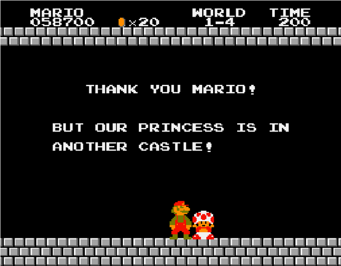

---
title:       Probieren hilft beim Studieren
subtitle:    Interaktive Vorlesungsfolien im Webbrowser
author:      Mario Botsch
affiliation: AG Computergrafik<br>Technische Fakultät
width:       1280
height:      800
...


# Anleitung für die HTML-Folien

- Mit **Cursor-links**/**Cursor-rechts** Folien durchschalten
- Klick auf **Seitenzahl** (rechts unten) öffnet Navigationsmenü
- Mit **f**/**ESC** Fullscreen-Modus an-/abschalten
- **Doppelklick** auf ein Element (z.B. ein Bild) für Rein-/Raus-Zoomen
- Wenn das **Icon** unten rechts rot ist 
  (<i class="fas fa-edit small" style="color:red"></i>),
  wurde etwas auf die virtuelle Tafel geschrieben. 
  Ein Mausklick auf das Icon zeigt/versteckt die Tafel.
- Für die 3D-Demos am besten Google Chrome oder Firefox verwenden.


--------------------------------------------------------------------------------

# Features der HTML-Folien {.section}

--------------------------------------------------------------------------------


# Bilder und Videos

::: col50
{ height=400px .fragment }
:::

::: col50
{ height=400px .controls .autoplay .fragment }
:::


# Aufzählungen

::: col50
::: incremental
- Supermario
    - Der Held
- Peach
    - Die Prinzessin
- Donkey Kong
    - Der böse Affe
:::
:::

::: col50
{ height=180px }
{      height=220px }
{ height=300px }
:::


# Textauszeichnungen

::: col50
- **Supermario**
    - ist fett
- Prinzessin ^Peach^
    - ist hochgestellt
- *Donkey Kong*
    - ist schräg
:::

::: col50
{ height=180px }
{      height=220px }
{ height=300px }
:::


# Numerierungen

::: col50
1. Donkey Kong
    - entführt Peach
2. Mario
    - rettet Peach
3. Peach
    - findet Mario toll
:::

::: col50

:::


# Task-Listen

::: col50
- Marios Aufgabenliste
    - [X] über Fässer springen
    - [X] Leitern hochklettern
    - [X] Donkey Kong verhauen
    - [ ] Prinzessin retten
:::

::: col50
{ width=500px }
:::


# Source Code

::: col50
Quicksort in Haskell\
``` haskell
qsort []     = []
qsort (x:xs) = qsort small ++ mid ++ qsort large
  where
    small = [y | y<-xs, y<x]
    mid   = [y | y<-xs, y==x] ++ [x]
    large = [y | y<-xs, y>x]
```
:::

::: col50
$\pi$ ausrechnen in C++\
``` cpp
int     i, N=100000000;
double  x, dx=1.0/(double)N;
double  f, pi=0.0;

for (i=0; i<N; ++i)
{
	x = (i+0.5) * dx;
	f = 4.0 / (1.0 + x*x);
	pi += dx * f;
}

printf("pi = %f\n", pi);
```
:::


# Tabellen

|                     | Powerpoint | LaTeX-Beamer | HTML-Folien |
|---------------------|:----------:|:------------:|:-----------:|
| plattformunabhängig |     😢     |      😊      |      😊     |
| Versionsverwaltung  |     😢     |      😊      |      😊     |
| Mathe-Formelsatz    |     😢     |      😊      |      😊     |
| Videos              |     😊     |      😢      |      😊     |
| Studi-Export        |     😢     |      😢      |      😍     |
| erweiterbar         |     😢     |      😢      |      😍     |
| interaktiv          |     😢     |      😢      |      😍     |
| Aufwand             |     😊     |      😢      |      😭     |


# Interaktive Charts

<canvas data-chart="bar">
<!--
{
 "data": {
  "labels": ["1.0", "1.3", "1.7", "2.0", "2.3", "2.7", "3.0", "3.3", "3.7", "4.0", "5.0", "6.0"],
  "datasets": [
   {
    "data": [5, 6, 5, 2, 3, 3, 4, 3, 3, 5, 11, 27],
    "label": "Irgendwelche Zahlen"
   },
   {
    "data": [11, 8, 5, 5, 2, 7, 4, 1, 5, 0, 15, 8],
    "label": "Andere Zahlen"
   }
  ]
 },
 "options": {
    "responsive": true,
    "scales": { "yAxes": [{ "ticks": { "min":0, "max":30, "stepSize":5 } }] }
  }
}
-->
</canvas>


# Einbinden von Webseiten

{ width=800px height=600px }


# Animierte Vektorgrafiken

{#svg width=800px}


# Interaktive Demos in Javascript

{ width=1000px height=600px }


# Mathe-Formeln mit LaTeX

- Navier-Stokes-Gleichungen
  $$\begin{eqnarray}
    \dot{\vec{u}} &=& -\vec{u}\cdot\grad\vec{u}
    \;-\; \frac{1}{\rho}\grad p
    \;+\; \nu \laplace \vec{u}
    \;+\; \vec{f}\\[2mm]
    \grad \cdot \vec{u} &=& 0
  \end{eqnarray}$$
- Zweite Flüssigkeit injizieren
  $$\dot{d} \;=\; -\vec{u} \cdot \grad d
     \;+\; \kappa \laplace d \;+\; s$$


# Komplexere Demos in C++

{ width=1000px height=600px }


# 3D-Modelle

{ width=800px height=600px }


# Interaktive 3D-Applikationen

{ width=1000px height=600px }


# Virtuelle Tafel

::: incremental

- Herleitungen an der Tafel sind nicht in Videoaufzeichnung
- Herleitungen auf den Folien sind zu schnell
  $$
  \begin{eqnarray}
  a &=& b \\
  a^2 &=& ab \\
  2a^2 &=& a^2 + ab \\
  2a^2-2ab &=& a^2 - ab \\
  2a(a-b) &=& a (a-b) \\
  2a &=& a \\
  2 &=& 1
  \end{eqnarray}
  $$
- Die virtuelle Tafel ist ein guter Kompromiss.

:::


# Audience Response System { .quiz }

{height=100px}
Wer bekommt am Ende die Prinzessin?

- [ ] Donkey Kong {height=100px}
      [Nein, der ist böse!]{.tooltip}
- [ ] Sponge Bob {height=100px}
      [Nein, der lebt unter Wasser!]{.tooltip}
- [ ] Kleine A-Loch {height=100px}
      [Nein, den mag keiner!]{.tooltip}
- [X] Supermario {height=100px} 
      [Klar!]{.tooltip}

[Hier können Vorlesungsteilnehmer*innen online abstimmen, wenn der Quiz-Server gestartet wird.]{.footer}


# PDF-Export

Folien lassen sich auf Knopfdruck als PDF exportieren.

[Hier gibt's das Resultat.](eLearning.pdf)


--------------------------------------------------------------------------------

# Folienerstellung {.section}

--------------------------------------------------------------------------------

# Von Markdown zu HTML

{ #svg }


# Open-Source "Zutatenliste"

::: w80

- [Reveal.js](https://github.com/hakimel/reveal.js/)
    - Javascript-Framework zur Darstellung von Folien im Webbrowser
- [Pandoc](https://pandoc.org/)
    - Tool zur Konvertierung von Markdown in HTML/JavaScript/Reveal.js.
    - Als Beispiel der [Quelltext](eLearning.md) zu diesem Vortrag
- [revealSlides](https://github.com/mbotsch/revealSlides)
    - Unsere erweiterte Version von Reveal.js, die die virtuelle Tafel und das Audience-Response-System enthält.
- [PMP-Library](http://www.pmp-library.org/)
    - Unsere Netzverarbeitungsbibliothek, mit der die 3D-Demos in C++ entwickelt wurden (*polygon mesh processing library*).

:::

